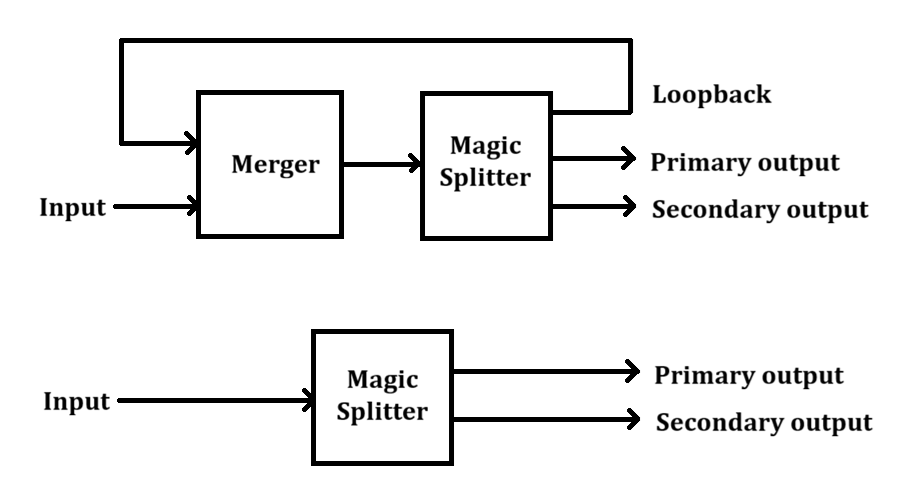

# One-to-many splitter

[![MIT license][license-badge]](LICENSE.md)
[![CI][ci-badge]][ci-workflow]

## Motivation

If you're playing a game like Factorio or Satisfactory that requires precise
throughout measurement, this project allows splitting one input into variable
outputs. Requires 1-to-$b$ splitters and often requires $N$-to-1 mergers.

For example, this project can help in designing a splitter that outputs
$\frac{2}{41}$ of the input and $\frac{39}{41}$ of the input in two separate
channels.

This project doesn't visually plan the machine's construction, only calculating
how to break down the input into a combination of splitters (and implicitly,
mergers). The resulting output will take one of the following forms:



## Running

1. Install Python 3 (any version from Python 3.11 through 3.14)
1. Clone this repository and enter the project directory:

    ```shell
    git clone https://github.com/Vessel9817/one_to_many_splitter
    cd one_to_many_splitter
    ```

1. Run the program:

    ```shell
    # Windows
    py -m "src.main"

    # Linux
    python3 -m "src.main"
    ```

The output will be a series of expressions that specify both the form of the
machine, as well as how to break the outputs down into the sum of resultants
from 1-to-$b$ splitters.

## Running tests

1. Run the test suite:

    ```shell
    # Windows
    py -m unittest discover

    # Linux
    python3 -m unittest discover
    ```

## Proof

Informally, the process works as follows: the input (taken to be 1. without
loss of generality) is split into two outputs, call them $o_1$ and $o_2$, and
an extraneous output $f$. For the input throughput to be preserved, it must be
true that $o_1+o_2+f = 1$. $f$ is fed back into the input so that we only end
up with two outputs.

Suppose that initially, we have the following outputs:

$$
o_1 \leftarrow A\\
o_2 \leftarrow B\\
f \leftarrow C
$$

After looping $f$ back into the machine, that output is passed through the
machine and split among the outputs:

$$
o_1 \leftarrow A+AC\\
o_2 \leftarrow B+BC\\
f \leftarrow C^2
$$

And again:

$$
o_1 \leftarrow A+AC+AC^2\\
o_2 \leftarrow B+BC+BC^2\\
f \leftarrow C^3
$$

Theoretically, this process should continue until $f=0$, which requires that
$\left|f\right| 1 $. Mathematically, the whole process with the actual
constants is represented as follows:

$$
\text{Let}\ c = \left\lceil \log_b y\right\rceil\\
\text{Let}\ o_1 = \sum_{n=0}^\infty\frac{x}{b^c}\left(\frac{y}{b^c}\right)^n \\
\text{Let}\ o_2 = \sum_{n=0}^\infty\frac{y-x}{b^c}\left(\frac{y}{b^c}\right)^n \\
o_1 = \frac xy \\
o_2 = \frac{y-x}{y} \\
o_1+o_2 = 1
$$

These converge, because:

$$\left|\frac{y}{b^c}\right| \leq 1$$

And in the case that $y = b^c$, then $\frac xy$ is a multiple of $b^{-c}$,
so we use 1-to-$b$ splitters without this feedback loop.

Since this process describes a conversion of $x$ and $y$ to base-$b$, the
theoretical runtime of $o_1$ and $o_2$ are also bounded by the number of
base-$b$ digits of $x$ and $y$.

[license-badge]: https://raw.githubusercontent.com/Vessel9817/one_to_many_splitter/refs/heads/main/badge.svg
[ci-badge]: https://github.com/Vessel9817/one_to_many_splitter/actions/workflows/ci.yml/badge.svg
[ci-workflow]: https://github.com/Vessel9817/one_to_many_splitter/actions/workflows/ci.yml
